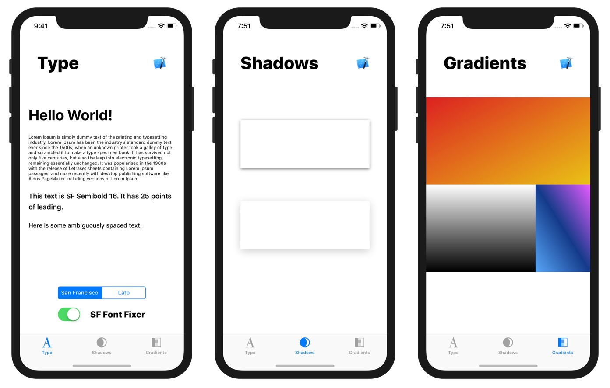

# sketch-vs-ios

## About

This app was used to investigate some rendering differences between Sketch and iOS. The original post which contains screenshots, gifs, and explanations can be found here:

[Medium Post — Why Your App Looks Better in Sketch](http://medium.com)

The app is best seen in-person on a real device which is why it is freely available to download, install, and modify.

## Installation

To run the app, download/clone the repo and open `SketchVsQuartz.xcodeproj` in Xcode 9. More details about the app can be found in [README.md](https://github.com/nathangitter/sketch-vs-ios/blob/master/SketchVsQuartz/SketchVsQuartz/README.md) within the Xcode project.

The Sketch file is named `Examples.sketch`.

## About Me

Interested in the intersection of art and technology? I build/write/share things on the internet:

[Follow me on Twitter](http://twitter.com/@nathangitter)

[Follow me on Medium](https://medium.com/@nathangitter)

## License

MIT © 2018 Nathan Gitter. See LICENSE for full details.